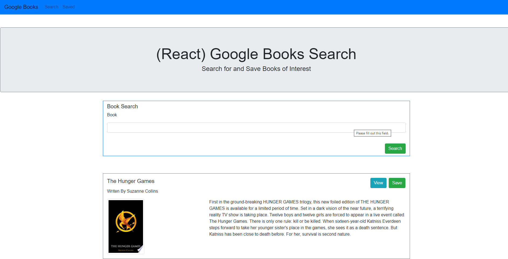

# Google-Books-Search (Full Mern Stack application)

### Overview
This application uses Node, Express, Mongodb/Mongoose, Axios, and React to create a website allows the user to enter in the name of any book they wish into a text box.  The user then pushes a "Search" button and application will take the entered information and query the Google Books API to retrieve information about the users request.  The application will post a list of the results returned from the query on the search page and will display the name of the book, the author of the book, an image of the book cover if available, and also a brief description of the book.  Along with this information this information 2 buttons will be available for the user to push.  One is the "View" button which is a link that sends the user to the part of the google website where further information on the book exists.  The other button is the "Save" button which will take all of the information for the associated book and save it in a mongo database for use later.  There is a navigation bar at the top of the page which has 2 selections, either "Search" or "Saved".  If you click on the "Search" selection in will take you to the "search" page, if you hit the "Saved" selection, it will take you the Saved page.  On the "Saved" page all the books saved in the mongo database will be display in a similar style to the books on the "Search" page.  2 buttons will also be available.  One button is again the "View" button, the other button is a "Delete" button which will remove the associated book entry from the database.  I was the sole creator of this website.

### How the application is organized
This application uses a server.js javascript files that creates a server using express.  The routes folder holds 3 javascript files which are responsible for the performing CRUD commands on the database.  The models file holds the schema files for creating the associated database and collections.  The creat folder hold all of the react components and pages responsible for creation of the DOM of the application.

### Technologies used in the application
1.  Javascript
2.  Node
3.  Express
4.  React
5.  Mongodb/Monogoose
6.  Axios
7.  CSS/Bootstrap
8.  React-Router-Dom

### Using the application
To use the application please go the deployed website below at Heroku.

  [Heroku Link](https://gentle-waters-40637.herokuapp.com/)

When you first git on the website it will take you to the Search  page.  Screenshot is shown below.

  

You will see a navigation bar which will have 2 links, one to the Search page and one to the Saved page.  It also contains a form which has a single text box for the user to enter in their book search request.  Finally a search button is present that the user can push to send the book search request to the server that will return a list of books it retrieved from the Google API based on the users request.

  

If no scrape has occured the Home page will ask what action you would like to take and gives you links to either Scarpe New Articles or go to the Saved Articles.  These links are circled in red below.

  

If a scrape has occured the Home page will show a list of articles (example shown below).  The top text is the headline of the article, which is a link to the actual NYT article (circled in purple below), and also a Saved Article button which will remove the article from the list of scraped articles and move it the Saved Articles page (circled in red below). 

  

Below is an image of the Saved Article Page which has a similar navigation bar to the Home page except it lacks the Scrape New Articles button.  If any articles have been saved then a list of the Saved Articles will appear with 2 buttons to the side of each article headline.  The headlines again are links to the actual website.  The red "Delete from Saved" article button will remove the associated Saved Article from the list of Saved Articles and place it back to the list of scraped but not Saved Articles.  The purple "Article Notes" note when clicked with activate a Notes modal when pressed.

  

If there are no scraped articles then the Saved Articles page will show a link back to the home page circled in red below.

  

Below is an image of the Notes modal, which appears when the Articles note button is pressed.  The modal header shows the associated id of the selected article.  The modal body will display a list of available notes and if no notes were made then it shows an alert that no notes for this article are available.  The body also has a textarea for the user to create a new note.  Finally, the modal footer has a Save Note button which will save the text entered into the textarea into the Notes collection.

  

The Notes Modal shown below, lists 2 saved notes.  There is a red "x" button next to each note which when pressed will remove the note document from the Notes collection and close the modal box.

  

### Links associated with the application
1.  Link to git hub repository for this app:  [Github Link](https://github.com/eozuna3/Google-Books-Search)
2.  Link to deployed heroku website:  [Heroku Link](https://gentle-waters-40637.herokuapp.com/)