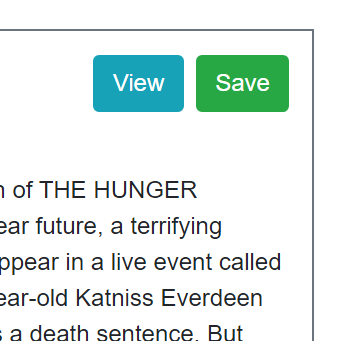
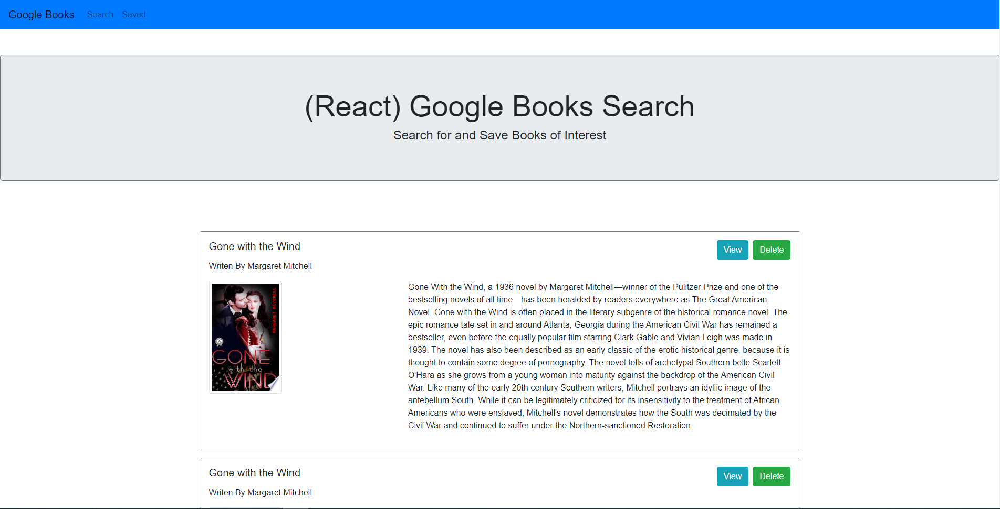
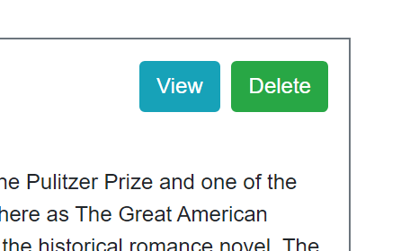

# Google-Books-Search (Full MERN Stack application)

### Overview
This application uses Node, Express, Mongodb/Mongoose, Axios, and React to create a website allows the user to enter in the name of any book they wish into a text box.  The user then pushes a "Search" button and application will take the entered information and query the Google Books API to retrieve information about the users request.  The application will post a list of the results returned from the query on the search page and will display the name of the book, the author of the book, an image of the book cover if available, and also a brief description of the book.  Along with this information this information 2 buttons will be available for the user to push.  One is the "View" button which is a link that sends the user to the part of the google website where further information on the book exists.  The other button is the "Save" button which will take all of the information for the associated book and save it in a mongo database for use later.  There is a navigation bar at the top of the page which has 2 selections, either "Search" or "Saved".  If you click on the "Search" selection in will take you to the "search" page, if you hit the "Saved" selection, it will take you the Saved page.  On the "Saved" page all the books saved in the mongo database will be display in a similar style to the books on the "Search" page.  2 buttons will also be available.  One button is again the "View" button, the other button is a "Delete" button which will remove the associated book entry from the database.  I was the sole creator of this website.

### How the application is organized
This application uses a server.js javascript files that creates a server using express.  The routes folder holds 3 javascript files which are responsible for the performing CRUD commands on the database.  The models file holds the schema files for creating the associated database and collections.  The creat folder hold all of the react components and pages responsible for creation of the DOM of the application.

### Technologies used in the application
1.  Javascript
2.  Node
3.  Express
4.  React
5.  Mongodb/Monogoose
6.  Axios
7.  CSS/Bootstrap
8.  React-Router-Dom

### Using the application
To use the application please go the deployed website below at Heroku.

  [Heroku Link](https://gentle-waters-40637.herokuapp.com/)

When you first git on the website it will take you to the Search page.  Screenshot is shown below.

  

You will see a navigation bar which will have 2 links, one to the Search page and one to the Saved page.  It also contains a form which has a single text box for the user to enter in their book search request.  Finally a search button is present that the user can push to send the book search request to the server that will return a list of books it retrieved from the Google API based on the users request.

  

Two buttons will appear next to each book entry, a "View" and "Save"  button.  When the user clicks on the "View" button it will take them to the google website for the book.  The "Save" button when clicked will save the book information into a mongo database collection use on the "Saved" page.

  

If the user clicks on the "Saved" selection in the navigation bar, they will be sent to "Saved" page.  This page will retrieve all of the previously saved books in the mongo database, and display a list of these books similar to the "Search"page.

  

Two buttons will appear next to each book entry, a "View" and "Delete" button.  When the user clicks on the "View" button it will take them to the google website for the book.  The "Delete" button when clicked will removed the book information entry from the mongo database and reload the page.

### Links associated with the application
1.  Link to git hub repository for this app:  [Github Link](https://github.com/eozuna3/Google-Books-Search)
2.  Link to deployed heroku website:  [Heroku Link](https://gentle-waters-40637.herokuapp.com/)